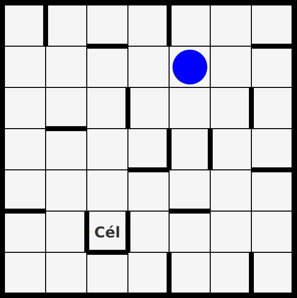

# myGame - Szoftverfejlesztés házi feladat projekt
 
A játék a [feladatok.pdf](https://arato.inf.unideb.hu/jeszenszky.peter/download/mestint/feladatok.pdf) 15. feladatát valósítja meg.
 
### Leírás: 
Juttassuk el a golyót az ábrán látható labirintus megjelölt mezőjére! 

A golyó a négy égtáj irányába mozoghat. 

Ha elindul valamelyik irányba, akkor addig gurul, amíg falba vagy a pálya szélébe nem ütközik.
 
 
 
 
 Remélem, hogy a játékom megfelel az összes [követelménynek](https://arato.inf.unideb.hu/jeszenszky.peter/download/swe/swe-spec_hu.pdf).
 
 ### A JAR fájl ide kattintva letölthető: [https://drive.google.com](https://drive.google.com/drive/folders/15-VY5a15SuGpeoKfbwAC6TpH-l3B0MHo?usp=sharing)
 
 Köszönettel tartozom Dr. Jeszenszky Péter Tanár Úrnak, mivel a játék a kódjain alapul.
